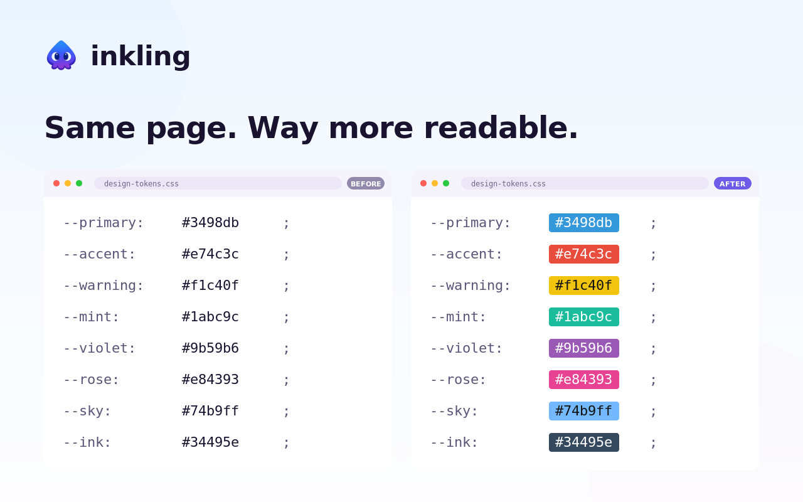
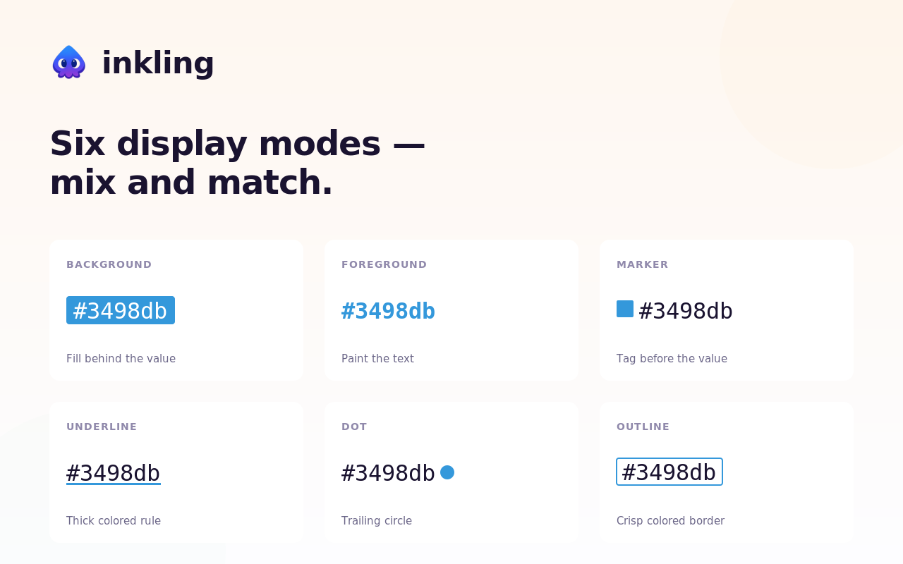

# inkling

<p align="center">
  
</p>

A Chrome extension that highlights color codes on web pages. Color strings like `#ff0000`, `rgb(0, 128, 255)`, and `hsl(120, 100%, 50%)` are instantly visualized with their actual color — no need to copy-paste into a color picker.

Inspired by [nvim-colorizer.lua](https://github.com/norcalli/nvim-colorizer.lua).

## Features

- Detects hex (`#rgb`, `#rrggbb`, `#rgba`, `#rrggbbaa`), `rgb()` / `rgba()`, and `hsl()` / `hsla()` — both legacy and modern CSS syntax
- 6 display modes, combinable:
  - **Background** — fills the text background with the color
  - **Foreground** — colors the text itself
  - **Marker** — colored square before the text
  - **Underline** — thick colored underline
  - **Dot** — colored circle after the text
  - **Outline** — colored border around the text
- Per-domain enable/disable
- Keyboard shortcut `Alt+Shift+C` to toggle on/off
- Handles dynamic content (SPAs, infinite scroll) via MutationObserver
- Skips editable areas (textarea, contenteditable, code editors)
- Flicker-free mode switching — no page reload needed
- Lightweight: ~12kb content script, no external dependencies

<p align="center">
  
</p>

## Install

### From source

```sh
git clone https://github.com/mei28/inkling.git
cd inkling
pnpm install
just build
```

Then load the `dist/` directory as an unpacked extension:

1. Open `chrome://extensions`
2. Enable "Developer mode"
3. Click "Load unpacked" and select the `dist/` folder

## Usage

Once installed, inkling automatically highlights color codes on every page. Click the toolbar icon to:

- Toggle the extension on/off
- Select one or more display modes
- Disable on the current site

## Supported color formats

| Format | Examples |
|---|---|
| Hex 3/4 digit | `#fff`, `#f0a8` |
| Hex 6/8 digit | `#ff00aa`, `#ff00aa80` |
| RGB/RGBA | `rgb(255, 0, 0)`, `rgb(255 0 0 / 50%)` |
| HSL/HSLA | `hsl(120, 100%, 50%)`, `hsl(120deg 100% 50% / 0.8)` |

## Development

Requires: Node.js, pnpm, [just](https://github.com/casey/just)

```sh
pnpm install
just watch    # esbuild watch mode
just test     # run tests (vitest)
just lint     # biome check
just typecheck
just check    # lint + typecheck + test
just serve    # demo page at localhost:3000
```

## Tech stack

- TypeScript (strict mode)
- esbuild (bundler)
- Vitest (testing)
- Biome (lint + format)
- Chrome Extension Manifest V3

## License

MIT
